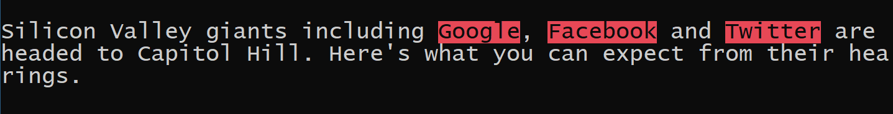
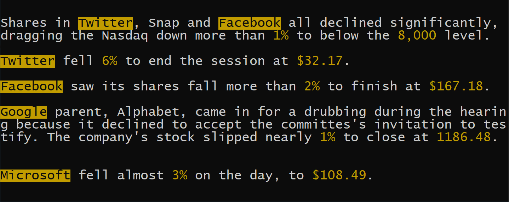
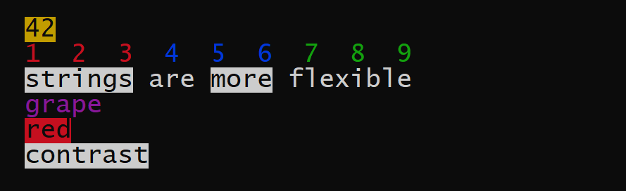
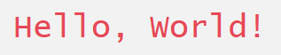

# Color Console

A lightweight header-only C++ library to bring colors to your Windows console with a very-easy-to-use API that frees you from the burden of setting and resetting screen colors every time you make a call.



## Contents

- [Installation](#instllation)
- [Getting Started](#getting-started)
- [Why Use It?](#why-use-it)
- [A Real Example](#a-real-example)
- [How to Use](#how-to-use)
  - [Color Tags](#color-tags)
  - [`dye` Namespace](#dye-namespace)
  - [`hue` Namespace](#hue-namespace)
- [Technical Note](#technical-note)

## Installation

Put [`color.hpp`](include/color.hpp) in the folder where you include headers.

*For Windows. C++11 support required. C++14 or above recommended.*

## Getting Started

```c++
#include "../include/color.hpp"
#include <iostream>

int main()
{
    std::cout << dye::aqua("Hello, World!") << std::endl;
    return 0;
}
```

You are seeing `Hello, World!` in aqua.

 

*Try saying [Hello, World](examples/hello.cpp) yourself.*

## Why Use It?


1. **No need to reset :**  most solutions on the market work like manipulators, which *constantly* require you to reset the screen color after you set it. While this traditional approach is also offered in this library in the `hue` namespace

   ```c++
   cout << "When in doubt, wear " << hue::red << "red"  << hue::reset << "." << endl;
   ```

   it can be boring to do so. Why not just `dye` the object

   ```c++
   cout << "When in doubt, wear " << dye::red("red") << "." << endl;
   ```

2. **Object-oriented :**  you may `dye` an object and save it for later (re)use

   ```c++
   auto green = dye::green("green");
   cout << "I saw "<< green << " trees, " << green << " bushes." << endl;
   ```

3. **`dye` anything :** `int` `double` `char` `std::string` ...

   ```c++
   cout << "Take the " << dye::blue("Blue") << " Line and then "
        << "catch Bus " << dye::yellow(42 + 7 % 8) << "."<< endl;
   ```

   In fact, you can `dye` any object for which `operator<<` is properly defined. Suppose we have

   ```c++
   struct DoubleVector;
   ostream & operator<<(ostream &, const DoubleVector &);
   ```

    we are free to `dye`

    ```c++
   cout << dye::purple(DoubleVector{3.14, 2.72}) << endl;
    ```


4. **`+`  dyed objects, even colors differ :**

   ```c++
   cout << dye::light_red('A') + dye::light_blue('B') + dye::light_green('C') << endl;
   ```

5. **Extra support for strings :**  be it `std::string` or C-style strings, dyed or undyed, you can mix them up without caring about their types.

   ```c++ 
   const char ca[] = "ca";
   string str = "str";
   cout << "[ " + dye::aqua(ca) + " | " + dye::aqua(str) + " ]" << endl;
   ```

6. **Convenient and extensible API :**  say `colorize` an object according to the parameter, or quickly `invert` the color

   ```c++
   double a = 88.88;
   cout << dye::colorize(a, a >= 0 ? "red" : "green").invert() << endl;
   ```

*Try the [above cases](examples/why.cpp) yourself.*

## A Real Example

With [Color Console](include/color.hpp), we implement an [auto marker](examples/mark.cpp) which highlights keywords given in a watch list and colorizes numbers as well. The key function is

```c++
using namespace std;

auto mark(const string & str, string color)
{
    istringstream iss(str);
    auto marked = dye::vanilla("");
    for (string line; getline(iss, line); marked += "\n") {
        istringstream lineiss(line);
        for (string text; lineiss >> text; marked += " ") {
            string pre, word, post;
            // split a text into 3 parts: word in middle, and punctuations around it
            separate(text, pre, word, post);
            marked += pre;
            if (is_keyword(word))
                marked += dye::colorize(word, color).invert();
            else if (is_number(word))
                marked += dye::colorize(word, color);
            else
                marked += word;
            marked += post;
        }
    }
    return marked;
}
```

To mark the introductory paragraph of a tech news

```c++
cout << mark(tech_news, "light_red") << endl;
```

You will see

 

As another example in which we mark both keywords and numbers

```c++
cout << mark(stock_news, "yellow") << endl;
```

We are having

 

*For the details, see the [full implementation](examples/mark.cpp).*

## How to Use

[Color Console](include/color.hpp) offers two sets of solutions which are put separately in two namespaces

1. objected-oriented `dye` ( :star:*highly recommended* ) 
2. console-oriented, manipulator-like, traditional `hue`

There are 16 single colors and thus 256 combinations (text + background) supported by Windows console.

Know the color tags and `dye` your console (or change its `hue`) immediately!

### **Color Tags**

  - **Single / Text**
    - ***Basic***    `black` `blue` `green` `aqua` `red` `purple` `yellow` `white` `grey`
    - ***Light***    `light_blue` `light_green` `light_aqua` `light_red` `light_purple` `light_yellow`
    - ***Bright***    `bright_white`

  - **Background**
    - `on_[single]` *e.g.*  `on_light_aqua`

  - **Compound**
    - `[single]_on_[single]` *e.g.*  `light_red_on_bright_white`

  - **Special**
    - `vanilla` do nothing  *i.e.* stay in current console color

### `dye` Namespace

***An object-oriented solution.***



- `dye::color_tag(object)` generates a dyed object ready for colorized output

   ```c++
   auto a = dye::on_yellow(42);
   cout << a << endl;
   ```

- You may use `+` or `+=` to make a chain of dyed objects. Colors may differ, so long as the types of the original objects stay the same.

    ```c++
    using vec = DoubleVector;
    
    auto b = dye::red(vec{1, 2, 3});
    b = b + dye::blue(vec{4, 5, 6});
    b += dye::green(vec{7, 8, 9});
    cout << b << endl;
    ```

- Rules for strings are even more flexible. You may `+` or `+=` any compatible strings, even those undyed ones.

    ```c++
    cout << dye::on_white(string("strings")) + " are " +
            dye::on_white("more") + string(" flexible") << endl;
    ```

- `dye::colorize(object, color_tag)` dyes `object` with `color_tag` 

    ```c++
    cout << dye::colorize("grape", "purple") << endl;
    ```

- `dye::invert(dyed)` generates a new object in inverted color. `dyed.invert()` does that in place.

    ```c++
    cout << dye::invert(dye::red("red")) << endl;
    
    auto contrast = dye::vanilla("contrast");
    cout << contrast.invert() << endl;
    ```

    *Try the [above cases](examples/how.cpp) yourself.*

### `hue` Namespace

***A console-oriented, manipulator-like, traditional solution.***

- `cout << hue::color_tag` to set the text color to `color_tag`

- `cout << hue::reset` to reset the console color (to white text and black background)

  ```c++
  #include "../include/color.hpp"
  #include <iostream>
  
  int main()
  {
      std::cout << hue::light_red << hue::on_bright_white
                << "Hello, World" << hue::reset << std::endl;
      return 0;
  }
  ```

  

  *Try saying [Hello, World](examples/hue.cpp) in the traditional manner.*

  *Note: Do remember to `reset`, otherwise you're causing troubles to late-users of the console.*

## Technical Note

- *move semantics* are widely used. Fast `+` operations are supported between dyed objects, especially for temporaries. Since more rvalues than lvalues are expected in use, we adopt a *pass-by-value-and-move* pattern.
-  `dye::red` and the like are in fact template factory functions that spit out dyed objects. Function template argument deduction is made use of to free users from having to specify the types explicitly (*e.g.* `dye::red<std::string>("hello")`).
- users shouldn't worry about the types of the dyed objects. If they want to, there are two layers of template classes:  a `dye::item<T>` to hold a single object, and a container `dye::colorful<item<T>>` to hold `item`(s). `item` is intermediate and kept internally. Users are always using `colorful`, of one or many `item`(s).
- a compile-time type-conversion technique (called `bar<T>`) is employed so that even function template argument deduction concludes it sees a `const char *` the dyed object generated would be based on `std::string`.


[Back to Top](#color-console)
