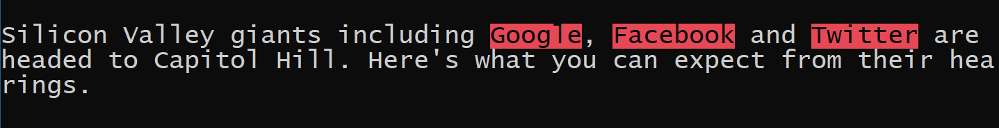
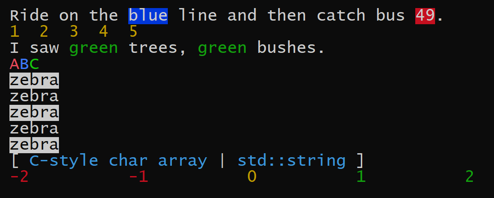
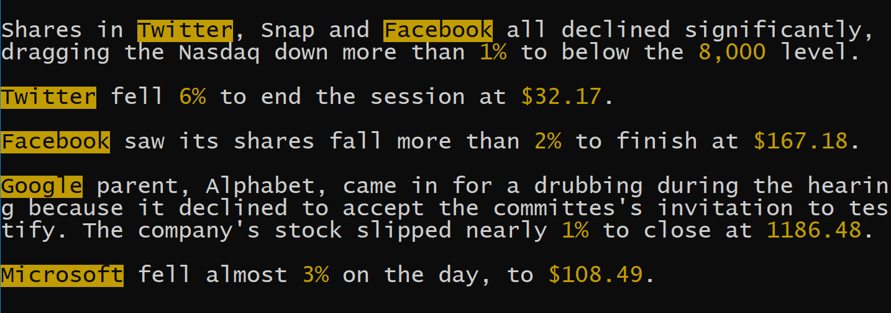

# Color Console

A lightweight, header-only C++ library to bring colors to your Windows/Linux/Mac console with a very-easy-to-use API.



## Contents

- [Features](#features)
- [Getting Started](#getting-started)
- [How to Use](#how-to-use)
  - [color tags](#color-tags)
  - [`dye` namespace](#dye-namespace)
  - [`hue` namespace](#hue-namespace)
- [Examples](#examples)
- [A Real Program](#a-real-program)
- [License](#license)

## Features

- **Object-Oriented**

    Ever used some other libraries, and getting tired of *constantly* setting and resetting screen colors? With OO design, this one saves you the hassle. Compare the old, manipulator approach

    ```c++
    std::cout << hue::red  << "red"  << hue::reset << " and " << hue::green << "green" << hue::reset << std::endl;
    ```

    with the new, OO approach

    ```c++
    std::cout << dye::red("red") + " and " + dye::green("green") << std::endl;
    ```

    | Manipulator approach                | Object-oriented approach                                     |
    | ----------------------------------- | ------------------------------------------------------------ |
    | Focus on the screen                 | Focus on the object to be colorized                          |
    | Need to reset screen colors         | No need to reset                                             |
    | Lack of reusability and flexibility | Colorized object can be reused, concatenated, or has its color inverted |

- **Cross-Platform**

    Coloring mechanism differs drastically between Windows and Unix consoles. With only one header and a unified API, this library manages all the details for you. It's now much easier to bring the same colors onto different platforms.

[Back to Top](#color-console)


## Getting Started

Put `color.hpp` in the folder for header files, and include it.

- Download [`color.hpp`](https://aafulei.github.io/projects/color-console/include/color.hpp) now
- View [`color.hpp`](/include/color.hpp) on GitHub

```c++
#include "color.hpp"
#include <iostream>

int main()
{
    std::cout << dye::aqua("Hello, World!") << std::endl;
    return 0;
}
```

Compile the above [code](examples/hello.cpp) with, for example,

```
g++ hello.cpp -I ../include
```

Run the executable. You are seeing hello world in aqua.


*For Windows, Linux, Mac OS and other Unix-like operating systems. C++11 support required. C++14 or above recommended.*

[Back to Top](#color-console)

## How to Use

This library groups all the functions into two namespaces:

- **`dye`** namespace: object-oriented approach ( :star:*highly recommended* )
- **`hue`** namespace: manipulator approach

Learn the color tags and you are ready to dye your objects.

### color tags

Consoles in general support 16 colors as listed below.

| #    | Color Tag (Basic)    | #    | Color Tag (Light)                |
| ---- | -------------------- | ---- | -------------------------------- |
| 0    | `black`              | 8    | `gray`                           |
| 1    | `blue`               | 9    | `light_blue`                     |
| 2    | `green`              | 10   | `light_green`                    |
| 3    | `aqua` / `cyan`      | 11   | `light_aqua` / `light_cyan`      |
| 4    | `red`                | 12   | `light_red`                      |
| 5    | `purple` / `magenta` | 13   | `light_purple` / `light_magenta` |
| 6    | `yellow`             | 14   | `light_yellow`                   |
| 7    | `white`              | 15   | `bright_white`                   |

*This library accepts cyan and magenta as variant names for aqua and purple, respectively.*

### `dye` namespace

With color tags, it's possible to change an object's foreground color, background color, or both. To specify that a color is for the background, add `on_` to the tag, *e.g.* `on_yellow` for yellow background.

As a general rule, `dye::[color_tag]()` colorizes a printable object with `color_tag` and prepares it for the right-hand side of `std::cout <<`. See examples below.

| Syntax              | Affect                         | Code Example                                             |
| ------------------- | ------------------------------ | -------------------------------------------------------- |
| `dye::[tag]`        | foreground color only          | `std::cout << dye::red("fire") << std::endl;`            |
| `dye::[on_tag]`     | background color only          | `std::cout << dye::on_green("forest") << std::endl;`     |
| `dye::[tag_on_tag]` | foreground + background colors | `std::cout << dye::white_on_blue("cloud") << std::endl;` |

In addition, using `dye::colorize()`, color tags can be supplied as a string parameter. For example,

```c++
std::cout << dye::colorize("black text on red background", "black_on_red") << std::endl;
```

### `hue` namespace

Examples below explain the rules.

| `dye` approach                               | `hue` equivalent                                        |
| -------------------------------------------- | ------------------------------------------------------- |
| `std::cout << dye::red("ruby");`             | `std::cout << hue::red << "ruby" << hue::reset;`        |
| `std::cout << dye::colorize("ruby", "red");` | `std::cout << hue::set("red") << "ruby" << hue::reset;` |

Meanwhile, `hue::set()` and `hue::reset()` themselves are standalone functions. It is legal to write

```c++
hue::set("red");
std::cout << "ruby";
hue::reset();
```

[Back to Top](#color-console)

## Examples



1. **Colorize Anything**

   Strings, numbers, user-defined classes. Anything that you can print you can color.

   ```c++
   // colorize anything -- strings, numbers...
   std::cout << "Ride on the "
             << dye::on_blue("blue") << " line and then catch bus "
             << dye::on_red(49) << "." << std::endl;

   // ... and even user-defined clasess
   std::cout << dye::yellow(my_vector{1, 2, 3, 4, 5}) << std::endl;
   ```

2. **Object-Oriented**

   Once colorized, an object can be reused, concatenated, or has its color inverted.

   ```c++
   // reuse a colorized object
   auto green = dye::green("green");
   std::cout << "I saw "<< green << " trees, " << green << " bushes." << std::endl;

   // concatenate objects (colors may differ)
   std::cout << dye::light_red('A') + dye::light_blue('B') + dye::light_green('C') << std::endl;

   // invert colors...
   auto zebra = dye::black_on_white("zebra");
   std::cout << zebra << std::endl;
   zebra.invert();
   std::cout << zebra << std::endl;
   zebra.invert();

   // ... with a chainable method that does not alter the state of the object
   std::cout << zebra << "\n"
             << zebra.reverse() << "\n"
             << zebra.reverse().reverse() << std::endl;
   ```

3. **Extra Support for Strings**

   Possible to mix up different types of strings: colored or uncolored, string literal, C-style string or `std::string`.

   ```c++
   const char ca[] = "C-style char array";
   std::string str = "std::string";
   std::cout << "[ " + dye::aqua(ca) + " | " + dye::aqua(str) + " ]" << std::endl;
   ```

4. **Parameterizable API**

   Accept a string as the parameter, and render the object with the given color tag.

   ```c++
   for (int i = -2; i != 3; ++i)
       std::cout << dye::colorize(i, i > 0 ? "green" : i == 0 ? "yellow" : "red") << " ";
   ```

Try the above [examples](examples/examples.cpp) yourself!

[Back to Top](#color-console)


## A Real Program

With Color Console, we implement an [automatic marker](examples/mark.cpp) that highlights keywords and numbers. The key function is

```c++
auto mark(const std::string & news, std::string color)
{
    std::istringstream iss(news);
    auto marked = dye::vanilla("");
    for (std::string line; std::getline(iss, line); marked += "\n") {
        std::istringstream lineiss(line);
        for (std::string word; lineiss >> word; marked += " ") {
            std::string pre, mid, post;
            // split a word into 3 parts: letters/numbers in middle, and punctuations around them
            split(word, pre, mid, post);
            if (!pre.empty())
                marked += pre;
            if (is_keyword(mid))
                marked += dye::colorize(mid, color).reverse();
            else if (is_number(mid))
                marked += dye::colorize(mid, color);
            else
                marked += mid;
            if (!post.empty())
                marked += post;
        }
    }
    return marked;
}
```

To mark the introductory paragraph of a tech news

```c++
std::cout << mark(tech_news, "light_red") << std::endl;
```

You will see


As another example, we mark both keywords and numbers

```c++
std::cout << mark(stock_news, "yellow") << std::endl;
```

We are having



*For the details, see the [full implementation](examples/mark.cpp).*

[Back to Top](#color-console)

## License

MIT

 Copyright (c) 2019 Aaron FU Lei

[Back to Top](#color-console)

